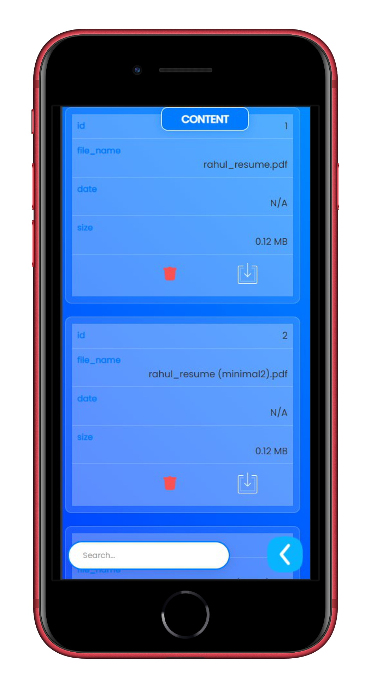

# Document Sharing Platform

Easily share a variety of content in almost any document format with this Flask-based web app. You can share files quickly and securely, with the option to share files publicly or keep them private. Plus, you no longer need to log in to WhatsApp on your desktop to share files—this platform handles it all for you!

## Features

### Two Ways to Share

1. **Share Without Login (General Section)**  
   - Paste your formatted content and click "Upload" to add it to the general section.
   - To retrieve the latest uploads, click the "Receive" button.

2. **Share by Logging In (Personal Section)**  
   - Log in to upload and manage your personal files securely.
   - Click "Your Data" to view and manage all your uploaded files.

### Ways to Upload Files

- **Upload Document Button**: Click "Upload Document" to add your files.
- **Drag and Drop**: Drag files directly into the upload area or browse your device to select files.

### Accessing Uploaded Files

- To access your uploaded files, go to your profile by clicking "Your Data" and then select "Files" to see all your uploads.

### Upload Limit

The platform supports almost any document type!

## Screenshots

### PC View


### Phone View




## Build and Run the Flask App

### Prerequisites

- Python 3.6+
- Flask
- Bootstrap (integrated via HTML/CSS/JavaScript)

### Steps to Build and Run

1. **Clone the Repository**
   ```bash
   git clone <repository-url>
   cd <repository-folder>
    python3 -m venv venv
    source venv/bin/activate  # On Windows use `venv\Scripts\activate`
    pip install -r requirements.txt
    flask run
